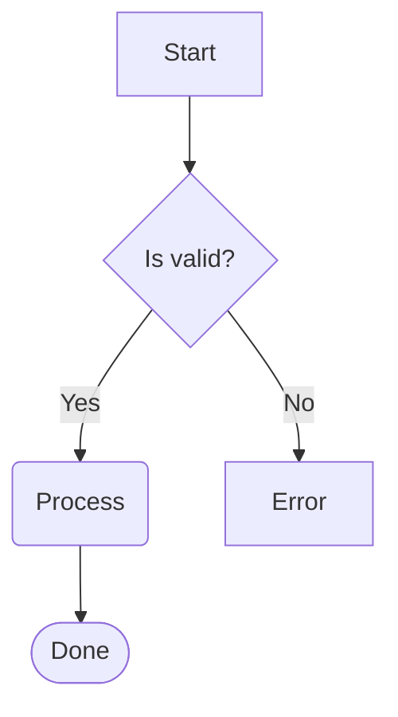
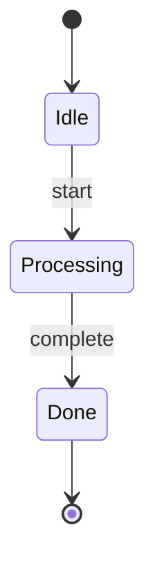

# termmaid

Render [Mermaid](https://mermaid.js.org/) diagrams as Unicode art in the terminal. Pure Python, zero dependencies.

```
┌─────────┐    ┌──────◇─────┐    ┌────────┐
│         │    │            │Yes │        │
│  Start  ├───►│  Decision  ├──╮►│   OK   │
│         │    │            │  │ │        │
└─────────┘    └──────◇─────┘  │ └────────┘
                               │
                               │No
                               │
                               │ ┌────────┐
                               │ │        │
                               ╰►│  Fail  │
                                 │        │
                                 └────────┘
```

## Why?

I needed Mermaid rendering for a Python project and couldn't find a library that worked
without a browser, Node.js, or external services. The existing tools in this space are
great, specially [mermaid-ascii](https://github.com/AlexanderGrooff/mermaid-ascii) (Go) and
[beautiful-mermaid](https://github.com/lukilabs/beautiful-mermaid) (TypeScript), but
neither offered a native Python library I could import and call directly.

## Install

```bash
pip install termmaid
```

## Usage

### CLI

```bash
termmaid diagram.mmd
echo "graph LR; A-->B-->C" | termmaid
termmaid diagram.mmd --color --theme terra
termmaid diagram.mmd --ascii
```

### Python

```python
from termmaid import render

print(render("graph LR\n  A --> B --> C"))
```

```python
# Colored output (requires: pip install termmaid[rich])
from termmaid import render_rich
from rich import print as rprint

rprint(render_rich("graph LR\n  A --> B", theme="terra"))
```

## Supported diagram types

### Flowcharts

All four directions: `LR`, `RL`, `TD`/`TB`, `BT`



```
┌─────────────┐
│             │
│    Start    │
│             │
└──────┬──────┘
       │
       ▼
┌──────◇──────┐
│             │
│  Is valid?  │
│             │
└──────◇──────┘
       │No
       ╰Yes─────────────╮
       ▼                ▼
╭─────────────╮    ┌─────────┐
│             │    │         │
│   Process   │    │  Error  │
│             │    │         │
╰──────┬──────╯    └─────────┘
       │
       ▼
╭─────────────╮
(             )
(    Done     )
(             )
╰─────────────╯
```

**Node shapes:** rectangle `[text]`, rounded `(text)`, diamond `{text}`, stadium `([text])`, subroutine `[[text]]`, circle `((text))`, hexagon `{{text}}`, cylinder `[(text)]`, and more.

**Edge styles:** solid `-->`, dotted `-.->`, thick `==>`, bidirectional `<-->`, labeled `-->|text|`

**Subgraphs:** Nesting, cross-boundary edges, labels

### State diagrams



## CLI options

| Flag | Description |
|------|-------------|
| `--ascii` | ASCII-only output (no Unicode box-drawing) |
| `--color` | Colored output (requires `pip install termmaid[rich]`) |
| `--theme NAME` | Color theme: default, terra, neon, mono, amber, phosphor |
| `--padding-x N` | Horizontal padding inside boxes (default: 4) |
| `--padding-y N` | Vertical padding inside boxes (default: 2) |
| `--sharp-edges` | Sharp corners on edge turns instead of rounded |

## Optional extras

```bash
pip install termmaid[rich]      # Colored terminal output
pip install termmaid[textual]   # Textual TUI widget
```

## Limitations

I tried to make it work with the majority of graphs but it's a lot of work, here are the biggest limitations of this project:

 - **Node positioning can be improved vastly.** The layout engine uses a fixed-stride grid where each node occupies a 3x3 block with 1-cell gaps (stride of 4). Nodes are placed layer-by-layer using a barycenter heuristic (3 passes) to reduce edge crossings, but this is an approximation of an NP-hard problem, so graphs with many cross-layer edges will still produce crossings. Collision resolution is naive: when a cell is occupied, the node shifts perpendicular by one full stride until it finds free space, with no attempt to pack nodes more densely or minimize wasted canvas area.
 - **Edge routing is Manhattan-only.** Edges are routed via A* pathfinding on a character grid, restricted to 4-directional movement (no diagonals). Previously routed edges are treated as soft obstacles (+2 cost) rather than hard walls, so later edges can overlap earlier ones in dense areas. The search is capped at 5,000 iterations, so very large or heavily constrained graphs may fail to find a path and fall back to a straight line.
 - **Sequence diagrams don't work.** Only flowcharts and state diagrams are supported.
 - **Sometimes labels after decisions are not well positioned.** Edge labels are placed by expanding gap cells between nodes on a first-come-first-served basis. When multiple labeled edges share the same gap, later labels may not get enough space.

## Acknowledgements

Inspired by [mermaid-ascii](https://github.com/AlexanderGrooff/mermaid-ascii) by Alexander Grooff
and [beautiful-mermaid](https://github.com/lukilabs/beautiful-mermaid) by Lukilabs.

## License

MIT
