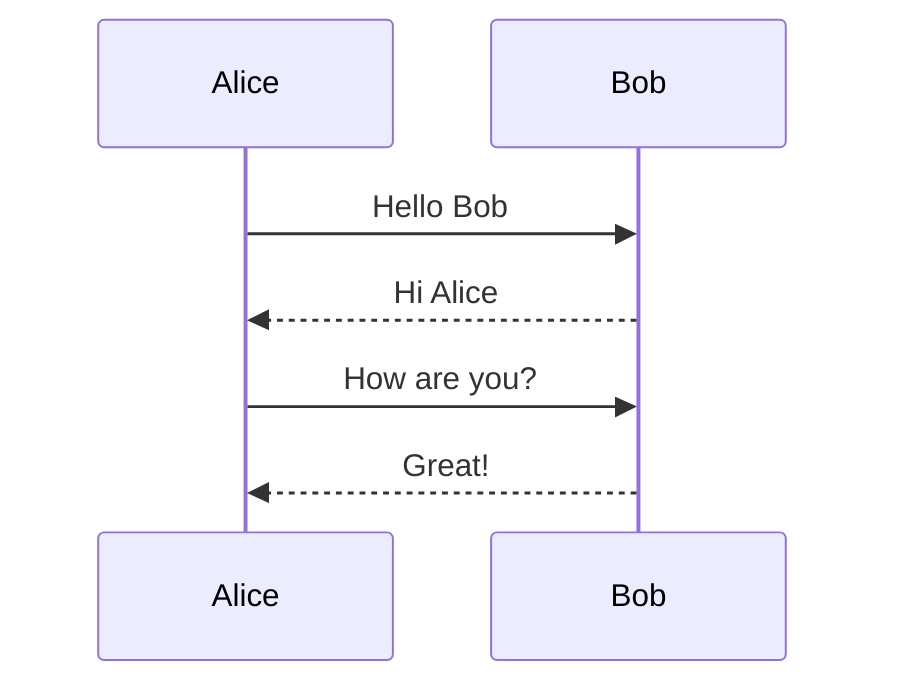
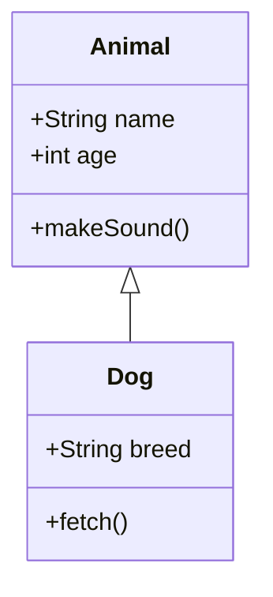
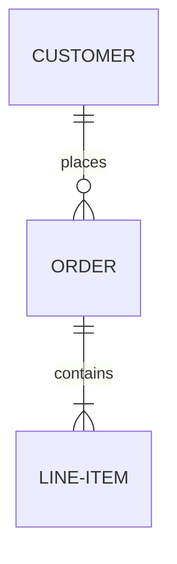
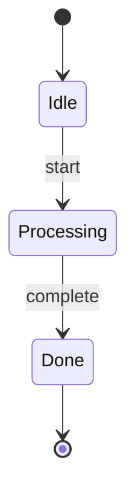
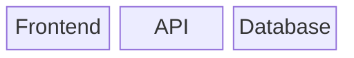
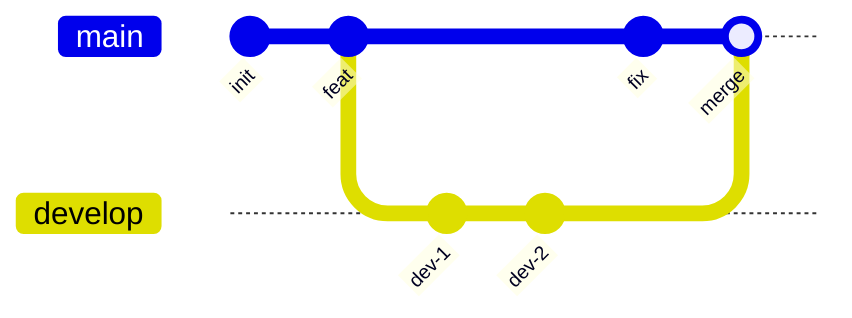

# termmaid

Terminal-native Mermaid rendering for Python.

```
┌─────────┐    ┌───────────┐    ┌───◇───┐    ╭────────╮
│         │    │           │    │       │Yes │        │
│  Start  ├───►│  Process  ├───►│  OK?  ├───►│  Done  │
│         │    │           │    │       │    │        │
└─────────┘    └───────────┘    └───◇───┘    ╰────────╯
```

Render [Mermaid](https://mermaid.js.org/) diagrams as Unicode art directly in your terminal. Pure Python, zero dependencies.

## Features

- **7 diagram types:** flowcharts, sequence, class, ER, state, block, and git graphs
- **Zero dependencies:** pure Python, nothing to install beyond the package itself
- **Rich and Textual integration:** colored output and TUI widgets with optional extras
- **6 color themes:** default, terra, neon, mono, amber, phosphor
- **ASCII fallback:** works on any terminal, even the most basic ones
- **Pipe-friendly CLI:** `cat diagram.mmd | termmaid` just works

## Why?

Mermaid is great for documentation, but rendering it usually means spinning up a browser or calling an external service. termmaid lets you render diagrams over SSH, in CI logs, inside TUI apps, or anywhere you have a Python environment. It was built because the existing tools in this space, like [mermaid-ascii](https://github.com/AlexanderGrooff/mermaid-ascii) (Go) and [beautiful-mermaid](https://github.com/lukilabs/beautiful-mermaid) (TypeScript), don't offer a native Python library you can import and call directly.

## Install

```bash
pip install termmaid
```

## Quick start

### CLI

```bash
termmaid diagram.mmd
echo "graph LR; A-->B-->C" | termmaid
termmaid diagram.mmd --theme neon
termmaid diagram.mmd --ascii
```

### Python

```python
from termmaid import render

print(render("graph LR\n  A --> B --> C"))
```

```python
# Colored output (requires: pip install termmaid[rich])
from termmaid import render_rich
from rich import print as rprint

rprint(render_rich("graph LR\n  A --> B", theme="terra"))
```

```python
# Textual TUI widget (requires: pip install termmaid[textual])
from termmaid import MermaidWidget

widget = MermaidWidget("graph LR\n  A --> B")
```

## Supported diagram types

### Flowcharts

All directions supported: `LR`, `RL`, `TD`/`TB`, `BT`.


```
┌─────────────┐
│             │
│    Start    │
│             │
└──────┬──────┘
       │
       │
       ▼
┌──────◇──────┐
│             │
│  Is valid?  │
│             │
└──────◇──────┘
       │
       │
       ╰──────────────────╮
    Yes│                  │No
       ▼                  ▼
╭─────────────╮    ┌─────────────┐
│             │    │             │
│   Process   │    │    Error    │
│             │    │             │
╰──────┬──────╯    └─────────────┘
       │
       │
       ▼
╭─────────────╮
(             )
(    Done     )
(             )
╰─────────────╯
```

**Node shapes:** rectangle `[text]`, rounded `(text)`, diamond `{text}`, stadium `([text])`, subroutine `[[text]]`, circle `((text))`, double circle `(((text)))`, hexagon `{{text}}`, cylinder `[(text)]`, asymmetric `>text]`, parallelogram `[/text/]`, trapezoid `[/text\]`, and `@{shape}` syntax

**Edge styles:** solid `-->`, dotted `-.->`, thick `==>`, bidirectional `<-->`, circle endpoint `--o`, cross endpoint `--x`, labeled `-->|text|`, variable length `--->`, `---->`

**Styling:** `classDef`, `style`, `linkStyle` directives, `:::className` suffix

**Subgraphs:** nesting, cross-boundary edges, per-subgraph `direction` override

**Other:** `%%` comments, `;` line separators, Markdown labels `` "`**bold** *italic*`" ``, `&` operator (`A & B --> C`)

### Sequence diagrams



```
 ┌──────────┐      ┌──────────┐
 │  Alice   │      │   Bob    │
 └──────────┘      └──────────┘
       ┆ Hello Bob       ┆
       ──────────────────►
       ┆ Hi Alice        ┆
       ◄┄┄┄┄┄┄┄┄┄┄┄┄┄┄┄┄┄┄
       ┆ How are you?    ┆
       ──────────────────►
       ┆ Great!          ┆
       ◄┄┄┄┄┄┄┄┄┄┄┄┄┄┄┄┄┄┄
       ┆                 ┆
```

**Message types:** solid arrow `->>`, dashed arrow `-->>`, solid line `->`, dashed line `-->`

**Participants:** `participant`, `actor`, aliases

### Class diagrams



```
  ┌──────────────┐
  │    Animal    │
  ├──────────────┤
  │ +String name │
  │ +int age     │
  ├──────────────┤
  │ +makeSound() │
  └──────────────┘
          △
          │
          │
          │
  ┌───────────────┐
  │      Dog      │
  ├───────────────┤
  │ +String breed │
  ├───────────────┤
  │ +fetch()      │
  └───────────────┘
```

**Relationships:** inheritance `<|--`, composition `*--`, aggregation `o--`, association `--`, dependency `..>`, realization `..|>`

**Members:** attributes and methods with visibility (`+` public, `-` private, `#` protected, `~` package)

### ER diagrams



```
  ┌──────────────┐
  │   CUSTOMER   │
  └──────────────┘
          │1
          │ places
          │
          │0..*
  ┌──────────────┐
  │    ORDER     │
  └──────────────┘
          │1
          │ contains
          │
          │1..*
  ┌──────────────┐
  │  LINE-ITEM   │
  └──────────────┘
```

**Cardinality:** `||` (exactly one), `o|` (zero or one), `}|` (one or more), `o{` (zero or more)

**Line styles:** solid `--`, dashed `..`

**Attributes:** type, name, keys (`PK`, `FK`, `UK`), comments

### State diagrams



```
╭───────◯──────╮
│              │
│      ●       │
│              │
╰───────◯──────╯
        │
        │
        ▼
╭──────────────╮
│              │
│     Idle     │
│              │
╰───────┬──────╯
        │
   start│
        ▼
╭──────────────╮
│              │
│  Processing  │
│              │
╰───────┬──────╯
        │
complete│
        ▼
╭──────────────╮
│              │
│     Done     │
│              │
╰───────┬──────╯
        │
        │
        ▼
╭───────◯──────╮
│              │
│      ◉       │
│              │
╰───────◯──────╯
```

**Features:** `[*]` start/end states, transition labels, `state "name" as alias`, composite states (`state Parent { }`), stereotypes (`<<choice>>`, `<<fork>>`, `<<join>>`)

### Block diagrams



```
  ┌──────────┐    ┌──────────┐    ┌──────────┐
  │          │    │          │    │          │
  │ Frontend │    │   API    │    │ Database │
  │          │    │          │    │          │
  └──────────┘    └──────────┘    └──────────┘
```

**Features:** `columns N`, column spanning (`blockname:N`), links between blocks, nested blocks

### Git graphs



```
  main    ───●─────●──────┼──────────────●──────●─
           init  feat     │             fix   merge
                          │                     │
  develop                 ●───────●─────────────┼
                        dev-1   dev-2
```

**Directions:** `LR` (default), `TB`, `BT`

**Commands:** `commit` (with `id:`, `type:`, `tag:`), `branch` (with `order:`), `checkout`/`switch`, `merge`, `cherry-pick`

**Commit types:** `NORMAL` (●), `REVERSE` (✖), `HIGHLIGHT` (■)

**Config:** `%%{init: {"gitGraph": {"mainBranchName": "master"}}}%%`

## CLI options

| Flag | Description |
|------|-------------|
| `--ascii` | ASCII-only output (no Unicode box-drawing) |
| `--color` | Colored output (requires `pip install termmaid[rich]`). Implied by `--theme`. |
| `--theme NAME` | Color theme (implies `--color`): `default`, `terra`, `neon`, `mono`, `amber`, `phosphor` |
| `--padding-x N` | Horizontal padding inside boxes (default: 4) |
| `--padding-y N` | Vertical padding inside boxes (default: 2) |
| `--sharp-edges` | Sharp corners on edge turns instead of rounded |

## Python API

### `render(source, ...) -> str`

Render a Mermaid diagram as a plain text string. Auto-detects diagram type.

### `render_rich(source, ..., theme="default") -> rich.text.Text`

Render as a [Rich](https://rich.readthedocs.io/) `Text` object with colors. Requires `pip install termmaid[rich]`.

### `MermaidWidget`

A [Textual](https://textual.textualize.io/) widget with a reactive `source` attribute. Requires `pip install termmaid[textual]`. Updates live when you change the `source` property.

```python
from termmaid import MermaidWidget

class MyApp(App):
    def compose(self):
        yield MermaidWidget("graph LR\n  A --> B")
```

## Themes

Six built-in themes for `--color` / `render_rich()`:

| Theme | Description |
|-------|-------------|
| `default` | Cyan nodes, yellow arrows, white labels |
| `terra` | Warm earth tones (browns, oranges) |
| `neon` | Magenta nodes, green arrows, cyan edges |
| `mono` | White/gray monochrome |
| `amber` | Amber/gold CRT-style |
| `phosphor` | Green phosphor terminal-style |

## Optional extras

```bash
pip install termmaid[rich]      # Colored terminal output
pip install termmaid[textual]   # Textual TUI widget
```

## Limitations

- **Layout engine is approximate.** Node positioning uses a grid-based barycenter heuristic. Graphs with many cross-layer edges may still produce crossings.
- **Manhattan-only edge routing.** Edges use A* pathfinding on a grid. Very dense graphs may have overlapping edges.

## Acknowledgements

Inspired by [mermaid-ascii](https://github.com/AlexanderGrooff/mermaid-ascii) by Alexander Grooff and [beautiful-mermaid](https://github.com/lukilabs/beautiful-mermaid) by Lukilabs.

## License

MIT
